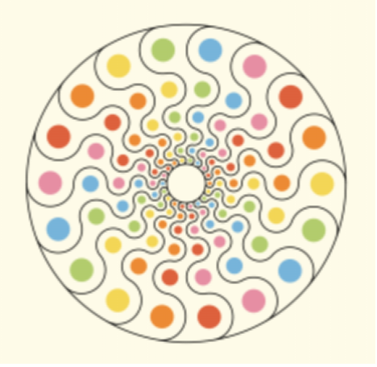
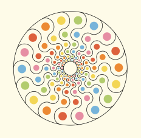

# QUIZ8

### Part 1: Imaging Technique Inspiration
<!-- #### Header 4
##### Header 5
###### Header 6 -->

<!-- **Bold Text** or __Bold Text__ -->
<!-- *Italic Text* or _Italic Text_ -->

- Our group chose Picita Abad's artwork Wheels of Fortune, which suggests movement and change, perhaps hinting at the unpredictability of fate, and from my perspective, the vibrant colors and superimposed circles seem to be a myriad of breathing beings.
  <div align=centre> 

- Therefore, I wanted to make the circle in the image that would zoom in and out so that the graphic would seem to be breathing, and make the graphic turn by rotating it left and right to make the image more vivid and impactful.
  <div align=centre>    
  <div align=centre>  

### Part 2: Coding Technique Exploration
- Circle Scaling
  
  After the circle is drawn, the circle is scaled by the change of the diameter size, and the speed of the diameter scaling is set to control the speed of the graphical changes, and the circle is scaled in reverse by using the if function with speed*=-1.

- Circle Rotation
  
  Use translate ( ) to move the origin of the drawing coordinate system to the center of the canvas, calculate the angle of rotation by tan ( ) and PI, and use a for loop to encircle the circle around the center of the circle.
  <div align=centre> 
  [Link Text](https://p5js.org/reference/#/p5/translate)


<!-- 1. First Item
1. Second Item
2. Third Item -->

[Link Text](https://www.google.com)


```
function helloWorld() {
console.log("Hello, world!");
}
```

> This is a blockquote.

use a "\\" to escape formatting
